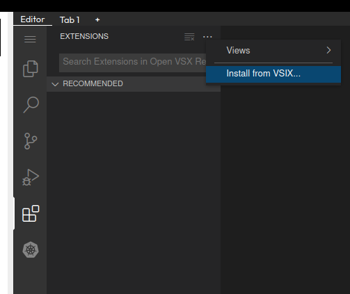

Jsonnet playground using the fast, rust-based [jrsonnet](https://github.com/CertainLach/jrsonnet) implementation.

For syntax highlighting & advanced editor features, install the Jsonnet language server shipped with this playground by clicking on `Extensions` -> `...` -> `Install from VSIX...` and selecting `vscode-jsonnet-0.3.3.vsix`.

